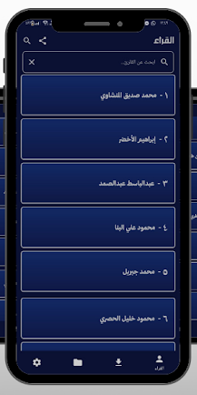
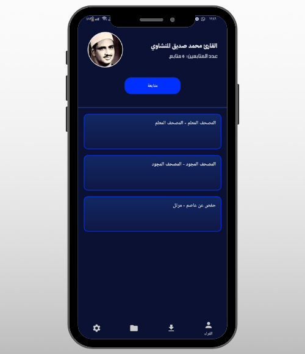
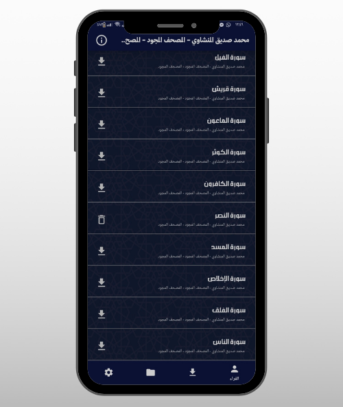

<div align="center">

# 🕌 Telawat - Quran Recitation App

### *Experience the Beauty of Quran with 220+ Reciters*

[](https://www.android.com/)
[](https://kotlinlang.org/)
[](LICENSE)
[](https://github.com/mohamed-faisal-salem/Telawat/stargazers)

[Download APK](#) • [Features](#-features) • [Screenshots](#-screenshots) • [Installation](#-installation)

</div>

---

## 📖 About

**Telawat** is a comprehensive Quran recitation application designed to provide an exceptional listening experience with voices of over 220+ renowned reciters from around the world. With its elegant interface and powerful features, Telawat makes accessing and enjoying Quran recitations effortless and spiritually enriching.

Whether you're memorizing, studying, or simply listening to the Quran, Telawat offers a seamless experience with beautiful design and intuitive navigation.

---

## ✨ Features

### 🎯 Core Features

- **220+ Reciters Library** - Access a vast collection of reciters, all in one place
- **Follow Your Favorite Reciters** - Keep track of your preferred Qaris and discover their latest recitations
- **Smart Ranking System** - Discover the most followed reciters and popular recitations
- **Quick Search** - Find any reciter instantly without endless scrolling
- **Last Position Memory** - Resume listening exactly where you left off
- **Background Playback** - Continue listening while using other apps or with screen off
- **Repeat & Continuous Play** - Perfect for memorization and uninterrupted listening
- **Multiple Recitation Styles (Riwayat)** - Access different recitation styles for each reciter

### 🎨 User Experience

- **Modern & Clean Design** - Beautiful interface with soothing colors
- **Light & Dark Mode** - Comfortable viewing in any lighting condition
- **Smooth Navigation** - Intuitive and easy-to-use interface
- **Offline Downloads** - Download surahs for offline listening
- **Download Management** - Easily manage and delete downloaded recitations

### 📱 Technical Features

- **High-Quality Audio** - Crystal clear recitation streaming
- **Efficient Storage** - Smart caching and download management
- **Fast Performance** - Optimized for smooth operation
- **Minimal Battery Usage** - Efficient background playback

---

## 📸 Screenshots

<div align="center">

### Main Interface

| Home Screen | Reciter Profile | Player Interface |
|-------------|----------------|------------------|
|  |  |  |

### Additional Views

| Search | Downloads | Dark Mode |
|--------|-----------|-----------|
|  |  |  |

</div>

> **Note:** Add your actual screenshots to a `screenshots/` folder in the repository

---

## 🚀 Installation

### For Users

1. Download the latest APK from [Releases](https://github.com/mohamed-faisal-salem/Telawat/releases)
2. Enable "Install from Unknown Sources" in your Android settings
3. Install and enjoy!

### For Developers

```bash
# Clone the repository
git clone https://github.com/mohamed-faisal-salem/Telawat.git

# Open in Android Studio
cd Telawat
# Open the project in Android Studio

# Build and run
# Use Android Studio's Run button or:
./gradlew assembleDebug
```

---

## 🛠️ Built With

- **Language:** Java (97.7%) & Kotlin (2.3%)
- **IDE:** Android Studio
- **Build System:** Gradle
- **Architecture:** MVVM (Model-View-ViewModel)
- **Libraries:**
  - ExoPlayer - For audio playback
  - Retrofit - For API calls
  - Room Database - For local storage
  - Glide - For image loading
  - Material Design Components

---

## 📋 Requirements

- **Minimum SDK:** 21 (Android 5.0 Lollipop)
- **Target SDK:** 34 (Android 14)
- **Internet Connection:** Required for streaming (optional for downloaded content)

---

## 🤝 Contributing

Contributions are welcome! Here's how you can help:

1. Fork the repository
2. Create your feature branch (`git checkout -b feature/AmazingFeature`)
3. Commit your changes (`git commit -m 'Add some AmazingFeature'`)
4. Push to the branch (`git push origin feature/AmazingFeature`)
5. Open a Pull Request

---

## 📝 License

This project is licensed under the MIT License - see the [LICENSE](LICENSE) file for details.

---

## 👨‍💻 Developer

**Mohamed Faisal Salem**

- GitHub: [@mohamed-faisal-salem](https://github.com/mohamed-faisal-salem)
- Email: your.email@example.com

---

## 🌟 Support

If you find this project useful, please consider:

- ⭐ Starring the repository
- 🐛 Reporting bugs
- 💡 Suggesting new features
- 🔀 Submitting pull requests

---

## 📞 Contact & Feedback

Have questions or suggestions? Feel free to:

- Open an [Issue](https://github.com/mohamed-faisal-salem/Telawat/issues)
- Submit a [Pull Request](https://github.com/mohamed-faisal-salem/Telawat/pulls)
- Reach out via email

---

<div align="center">

### May Allah accept this work and make it beneficial for the Ummah 🤲

**Made with ❤️ for the Muslim Community**

</div>
